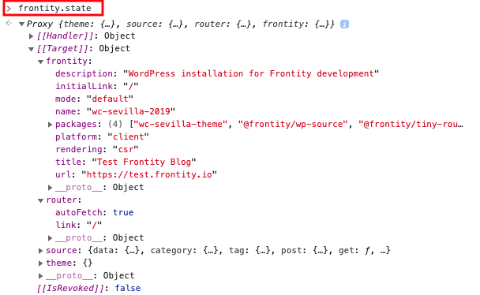
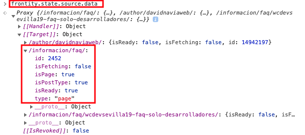
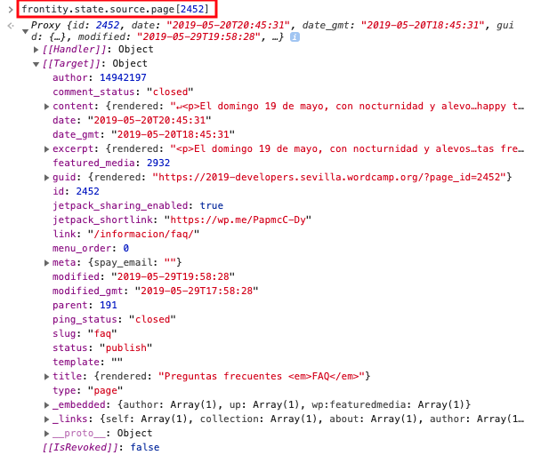

# Crea un tema con React en menos de 30 minutos

## 1. Crear un proyecto con Frontity

Lo primero que vamos a hacer es crear un nuevo projecto de Frontity.

Para eso, vamos utilizar este comando:

```bash
npx frontity create wc-sevilla
```

Cuando termine tendremos una nueva carpeta `/wc-sevilla` con el código de nuestro proyecto.

Arrancamos el proyecto para ver que está funcionando:

```
cd wc-sevilla
npx frontity dev
```

Abrimos http://localhost:3000 en el navegador (si no se ha abierto ya) y vemos nuestro primer proyecto de Frontity. De momento tiene el "starter theme" que viene por defecto: `@frontity/mars-theme` y está conectado a un WordPress de testing (https://test.frontity.io).

Ahora vamos a cambiar las settings para apuntar a la REST API de la web del WC Sevilla 2019.

- Abrimos el archivo `frontity.settings.js`. Este fichero contiene la configuración de los paquetes de Frontity que estemos usando en el proyecto.
- Cambiamos la configuración del campo `"api"` del paquete `@frontity/wp-source`:

Cambiamos esto:

```js
state: {
  source: {
    api: "https://test.frontity.io/wp-json";
  }
}
```

Por esto:

```js
state: {
  source: {
    api: "https://2019-developers.sevilla.wordcamp.org/wp-json";
  }
}
```

Y si refrescamos, deberíamos ver los posts de la web del WC Sevilla 2019.

## 2. Crear un tema desde cero

En vez de usar el tema que viene por defecto (`@frontity/mars-theme`) vamos a crear un nuevo paquete para el código de nuestro tema.

Paramos el proceso anterior (CONTROL+C) y después ejecutamos:

```bash
npx frontity create-package wc-sevilla-theme
```

Nos preguntará qué `namespace` queremos. Como es un tema, vamos a usar `theme`.

Una vez haya terminado tendremos una nueva carpeta `/packages/wc-sevilla-theme` en la que ya podemos empezar a trabajar.

Ahora tenemos que quitar `@frontity/mars-theme` de nuestras settings y sustituirlo por `wc-sevilla-theme`.

Eliminamos:

```js
{
  name: "@frontity/mars-theme",
  state: {
    theme: {
      menu: [
        ["Home", "/"],
        ["Nature", "/category/nature/"],
        ["Travel", "/category/travel/"],
        ["Japan", "/tag/japan/"],
        ["About Us", "/about-us/"]
      ],
      featured: {
        showOnList: false,
        showOnPost: false
      }
    }
  }
},
```

Y lo sustituimos por:

```js
{
  "name": "wc-sevilla-theme"
},
```

Por último, volvemos a arrancar el proyecto:

```bash
npx frontity dev
```

## 3. Modificar el primer componente

Empezaremos modificando el componente `<Root>` que se encuentra en el fichero `/packages/wc-sevilla-theme/src/index.js`, para que devuelva un `<h1>` con "WordCamp Sevilla 💃".

```jsx
const Root = () => {
  return (
    <>
      <h1>WordCamp Sevilla 💃</h1>
    </>
  );
};
```

Ahora vamos a mover el componente `<Root>` a su propio archivo `Root.js`.

```jsx
// Archivo: /packages/wc-sevilla-theme/src/Root.js

import React from "react";

const Root = () => {
  return (
    <>
      <h1>WordCamp Sevilla 💃</h1>
    </>
  );
};

export default Root;
```

Y finalmente lo importamos desde `index.js`.

```jsx
// Archivo: /packages/wc-sevilla-theme/src/index.js

import Root from "./Root";

export default {
  name: "wc-sevilla-theme",
  roots: {
    theme: Root
  },
  state: {
    theme: {}
  },
  actions: {
    theme: {}
  }
};
```

## 4. Conectarlo al estado

Vamos conectar el componente `<Root>` al estado de Frontity usando `connect`.

Después, vamos a mostrar la URL en la que estamos, usando `state.router.link`:

```jsx
// Archivo: /packages/wc-sevilla-theme/src/Root.js

import React from "react";
import { connect } from "frontity";

const Root = ({ state }) => {
  return (
    <>
      <h1>WordCamp Sevilla 💃</h1>
      <p>Estamos en {state.router.link}</p>
    </>
  );
};

export default connect(Root);
```

Podemos probar con una URL como: `http://localhost:3000/hola-sevilla` y vemos cómo cambia `state.router.link`.

## 5. Añadir un menú

Creamos un componente `<Link>` en un nuevo archivo `Link.js`:

```jsx
// Archivo: /packages/wc-sevilla-theme/src/Link.js

import React from "react";
import { connect } from "frontity";

const Link = ({ href, actions, children }) => {
  return (
    <div>
      <a
        href={href}
        onClick={event => {
          event.preventDefault();
          actions.router.set(href);
        }}
      >
        {children}
      </a>
    </div>
  );
};

export default connect(Link);
```

Dentro de `<Root>` importamos el componente Link y añadimos un menú con dos rutas: "Inicio" y "Preguntas frecuentes":

```jsx
// Archivo: /packages/wc-sevilla-theme/src/Root.js

import Link from "./Link";

const Root = ({ state }) => {
  return (
    <>
      <h1>WordCamp Sevilla 💃</h1>
      <p>Estamos en {state.router.link}</p>
      <div>
        <Link href="/">Inicio</Link>
        <Link href="/informacion/faq/">Preguntas Frecuentes</Link>
      </div>
    </>
  );
};
```

## 6. Usar los datos de la URL actual

Vamos a investigar un poco cómo funciona Frontity por debajo.

Para ello vamos a acceder a http://localhost:3000/informacion/faq/ en el navegador y abrimos la consola. Después vamos a usar `frontity.state` para ver el estado de Frontity:

<p align="center">
  
</p>

_–> Frontity usa proxies así que para ver el estado hay que abrir la propiedad `[[Target]]`_

Vemos que hay estado general sobre `frontity`, también sobre `router` (incluyendo el `state.router.link` que hemos usado ya) y en `source` hay muchas cosas.

En concreto vamos a fijarnos en `state.source.data`. Ahí se almacena la información de cada URL. Si inspeccionamos `/informacion/faq` podemos ver que es una página y tiene el ID `2452`.

<p align="center">
  
</p>

Con esa información podemos acceder a los datos (título, contenido...) de esa página usando `state.source.page[2452]`:

<p align="center">
  
</p>

Cuando se navega, el paquete `@frontity/wp-source` se trae todo lo necesario automáticamente y lo almacena en `state.source`.

Si abrimos la pestaña Network y hacemos click en el menu para ir a `Inicio`, podemos que se hace una llamada a la REST API para traerse los últimos posts.

Miramos en `frontity.state.source.data` y vemos que hay muchos datos populados.

Vamos a usar todo esto en nuestro código.

_-> En vez de usar `state.source.data[url]` vamos a usar `state.source.get(url)` que se asegura de que las urls incluyan siempre la barra final. Es decir, `/mi-url/` es igual que `/mi-url`._

Obtenemos la información del link actual (`state.router.link`) y lo usamos para ver si es una lista, un post o una página.

```jsx
const Root = ({ state }) => {
  const data = state.source.get(state.router.link);

  return (
    <>
      <h1>WordCamp Sevilla 💃</h1>
      <p>Estamos en {state.router.link}</p>
      <div>
        <Link href="/">Inicio</Link>
        <Link href="/page/2">Inicio - página 2</Link>
        <Link href="/informacion/faq/">Preguntas Frecuentes</Link>
      </div>
      <hr />
      {data.isArchive && <div>Es una lista</div>}
      {data.isPost && <div>Es un post</div>}
      {data.isPage && <div>Es una página</div>}
    </>
  );
};
```

## 7. Mostrar la lista de posts

Para mostrar la lista de posts, vamos a hacer un componente `<List>` que muestra la información que hay en `state.source.data`: el `type`, `id` y `link` de cada posts.

```jsx
import React from "react";
import { connect } from "frontity";

const List = ({ state }) => {
  const data = state.source.get(state.router.link);

  return (
    <div>
      {data.items.map(item => {
        return (
          <div key={id}>
            {item.type} – {item.id} – {item.link}
          </div>
        );
      })}
    </div>
  );
};

export default connect(List);
```

Y lo importamos en `Root.js`:

```jsx
// ...
import List from "./List";

const Root = ({ state }) => {
  const data = state.source.get(state.router.link);

  return (
    <>
      {/* ... */}
      {data.isArchive && <List />}
      {data.isPost && <div>Es un post</div>}
      {data.isPage && <div>Es una página</div>}
    </>
  );
};
```

Ahora, desde el componente `<List>` accedemos a la información de cada uno de los posts, para mostrar el título y convertirlo en un link.

```jsx
import React from "react";
import { connect } from "frontity";
import Link from "./Link";

const List = ({ state }) => {
  const data = state.source.get(state.router.link);

  return (
    <div>
      {data.items.map(({ id }) => {
        const post = state.source.post[id];
        return (
          <Link key={id} href={post.link}>
            {post.title.rendered}
          </Link>
        );
      })}
    </div>
  );
};
```

## 8. Mostrar el contenido de los posts

Creamos un componente `<Post>` para que muestre el título y el contenido:

```jsx
import React from "react";
import { connect } from "frontity";

const Post = ({ state }) => {
  const data = state.source.get(state.router.link);
  const post = state.source.[data.type][data.id];

  return (
    <div>
      <h2>{post.title.rendered}</h2>
      <div dangerouslySetInnerHTML={{ __html: post.content.rendered }} />
    </div>
  );
};

export default connect(Post);
```

Y ahora, igual que antes, lo importamos en `Root.js` y lo usamos para los posts y las páginas:

```jsx
// ...
import Post from "./Post";

const Root = ({ state }) => {
  const data = state.source.get(state.router.link);

  return (
    <>
      {/* ... */}
      {data.isArchive && <List />}
      {data.isPost && <Post />}
      {data.isPage && <Post />}
    </>
  );
};
```

## 9. Añadir algo de estilo

Ahora mismo nuestra página no tiene ningún estilo. Vamos a añadir unos muy básicos para que al menos el contenido esté bien posicionado.

Lo primero que haremos será crear unos estilos globales y cambiar la fuente para que sea `sans-serif`. Para ello, importamos el componente `<Global>` de frontity y la función `css`, en `Root.js`.

```jsx
// ...
import { connect, Global, css } from "frontity";

const Root = ({ state }) => {
  const data = state.source.get(state.router.link);

  return (
    <>
      <Global
        styles={css`
          html {
            font-family: sans-serif;
          }
        `}
      />
      {/* ... */}
    </>
  );
};
```

La fuente tiene que haber cambiado automáticamente en nuestra web.

Ahora, vamos a crear algunos componentes de CSS. Estos componentes se crean usando `styled` seguido del tag de HTML que queremos usar, y a continuación un _template string_ con el código CSS.

Para que veamos un ejemplo, vamos a crear dos componente `<Header>`, `<Menu>` y `<Body>` usando `styled`.

En el fichero `Root.js`, importamos `styled` y creamos los componentes anteriores.

```jsx
// ...
import { connect, Global, css, styled } from "frontity";

// ...

const Header = styled.div`
  display: flex;
  flex-direction: column;
  align-items: center;

  h1 {
    font-size: 3em;
    text-align: center;
  }
`;

const Menu = styled.div`
  display: flex;
  flex-direction: row;
  flex-wrap: wrap;
  justify-content: center;

  & > div {
    margin: 16px;
  }
`;

const Body = styled.div`
  max-width: 800px;
  margin: auto;
  padding: 16px;

  img {
    max-width: 100%;
  }
`;
```

Una vez creados, los usaremos dentro de `<Root>`

```jsx
const Root = ({ state, actions }) => {
  const data = state.source.get(state.router.link);

  return (
    <>
      <Global
        styles={css`
          html {
            font-family: sans-serif;
          }
        `}
      />
      <Header>
        <h1>WordCamp Sevilla 💃</h1>
        <p>Estamos en {state.router.link}</p>
        <Menu>
          <Link href="/">Inicio</Link>
          <Link href="/page/2">Inicio - página 2</Link>
          <Link href="/informacion/faq">Preguntas frecuentes</Link>
        </Menu>
      </Header>
      <hr />
      <Body>
        {data.isArchive && <List />}
        {data.isPost && <Post />}
        {data.isPage && <Post />}
      </Body>
    </>
  );
};
```

Los elementos de la cabecera de nuestra página, como el título y el menú, se verán ahora un poco mejor posicionados, al igual que el contenido de las páginas.

Haremos lo mismo para el componente `<List>`.

En el fichero `List.js`, añadimos el componente `<Items>` y lo usamos dentro de`<List>`.

```jsx
const Items = styled.div`
  & > div {
    margin: 16px 0;
    font-size: 1.2em;
  }
`;

const List = ({ state }) => {
  const data = state.source.get(state.router.link);

  return (
    <Items>
      {data.items.map(item => {
        const post = state.source.post[item.id];
        return (
          <Link href={post.link} key={post.id}>
            {post.title.rendered}
          </Link>
        );
      })}
    </Items>
  );
};
```

Nos queda añadir algún estilo dinámico, para que veamos cómo modificar los estilos en función del estado.

Por ejemplo, vamos a hacer que el color de fondo de nuestro `<Header>` cambie en función de la página que estemos visitando. Para ello, podemos añadir una función dentro del _template string_ de `<Header>`, donde podremos utilizar las props que le pasemos a dicho componente. En este caso, va a recibir la prop booleana `isPostType`, y mostrar un color azul si es `true` o verde si es `false`.

```jsx
const Header = styled.div`
  display: flex;
  flex-direction: column;
  align-items: center;
  background-color: ${({ isPostType }) =>
    isPostType ? "lightblue" : "palegreen"};

  h1 {
    font-size: 3em;
    text-align: center;
  }
`;
```

Una vez añadida la función, podemos pasarle la prop `isPostType` a `<Header>`.

```jsx
const Root = ({ state, actions }) => {
  const data = state.source.get(state.router.link);

  return (
    <>
      {/* ... */}
      <Header isPostType={data.isPostType}>
        <h1>WordCamp Sevilla 💃</h1>
        <p>Estamos en {state.router.link}</p>
        <Menu>
          <Link href="/">Inicio</Link>
          <Link href="/page/2">Inicio - página 2</Link>
          <Link href="/informacion/faq">Preguntas frecuentes</Link>
        </Menu>
      </Header>
      {/* ... */}
    </>
  );
};
```

Nuestra web es ahora ligeramente más _bonita_.

## 10. Usar `state` y `actions`

Por último, vamos a aprender cómo añadir nuestro propio estado y nuestras propias acciones.

Volvemos al archivo `index.js` y añadimos una nuevo campo llamado `isMenuOpen` en `state.theme`. Por defecto lo vamos a dejar en `false`:

```js
export default {
  name: "wc-sevilla-theme",
  roots: {
    theme: Root
  },
  state: {
    theme: {
      isMenuOpen: false // añadimos este campo
    }
  },
  actions: {
    theme: {}
  }
};
```

También vamos a añadir dos acciones para modificar ese campo. Una para abrir el menú y otra para cerrarlo:

```js
export default {
  name: "wc-sevilla-theme",
  roots: {
    theme: Root
  },
  state: {
    theme: {
      isMenuOpen: false
    }
  },
  actions: {
    theme: {
      openMenu: ({ state }) => {
        state.theme.isMenuOpen = true;
      },
      closeMenu: ({ state }) => {
        state.theme.isMenuOpen = false;
      }
    }
  }
};
```

Por último, vamos a ir a nuestro archivo `Root.js` y vamos a modificar nuestro componente `<Root>` para que el menú sólo se muestre cuando está abierto.

Cambiamos esto:

```jsx
<Menu>
  <Link href="/">Inicio</Link>
  <Link href="/page/2">Inicio - página 2</Link>
  <Link href="/informacion/faq">Preguntas frecuentes</Link>
</Menu>
```

Por esto:

```jsx
{
  state.theme.isMenuOpen ? (
    <>
      <Menu>
        <Link href="/">Inicio</Link>
        <Link href="/page/2">Inicio - página 2</Link>
        <Link href="/informacion/faq">Preguntas frecuentes</Link>
      </Menu>
    </>
  ) : null;
}
```

El menú ha desaparecido, pero no te preocupes, vamos a añadir dos botones.

Primero uno que se muestre cuando

```jsx
{
  state.theme.isMenuOpen ? (
    <>
      <Menu>
        <Link href="/">Inicio</Link>
        <Link href="/page/2">Inicio - página 2</Link>
        <Link href="/informacion/faq">Preguntas frecuentes</Link>
      </Menu>
    </>
  ) : (
    <button onClick={actions.theme.openMenu}>Menu</button>
  );
}
```
